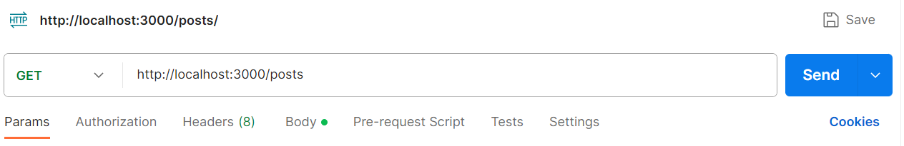
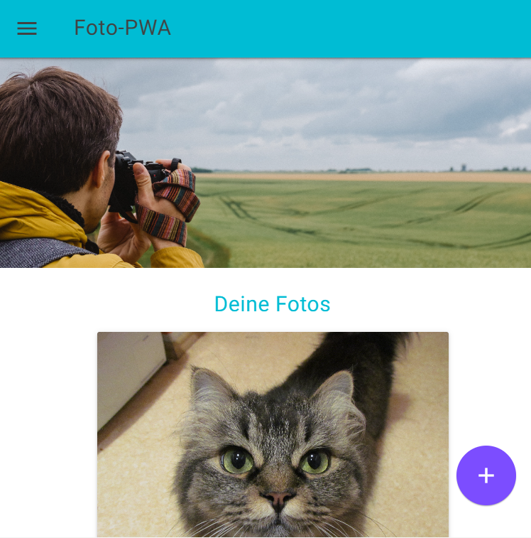
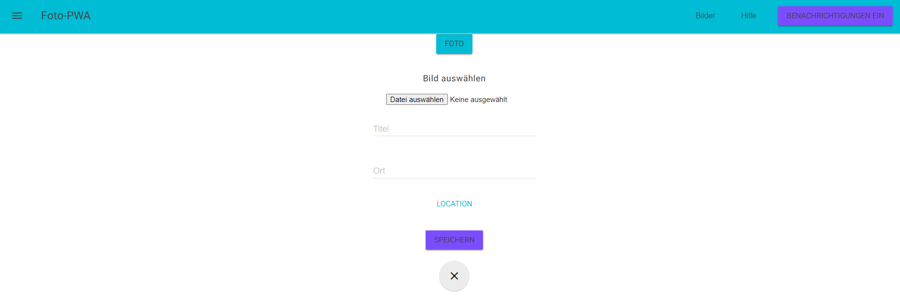
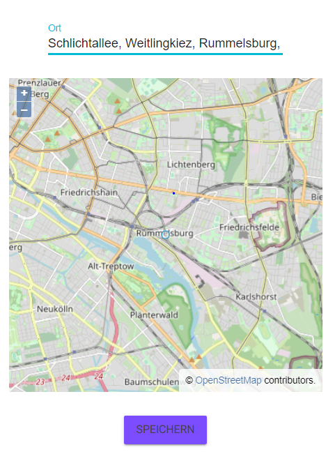
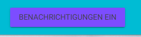

# Progressive Web Apps - Aktuelle Trends der IKT 2023

Dieses Projekt ist eine progessive Web Application, welche Bilder in einer Datenbank speichert. Man kann eine Erweiterung für die Web-App installieren und sie auch offline nutzen.

## Download 

Um die Anwendung nutzen zu können, ist es zunächst notwendig den Code über github herunterzuladen.

Um das Paket herunterzuladen, klicken Sie auf die grüne Schaltfläche auf der '<> Code' steht. Danach drücken Sie auf das 'Download ZIP' Feld, um die Datei auf ihren Rechner herunterzuladen.
Nachdem Sie den Ordner, durch Rechtsklick 'Ordner entpacken' entpackt haben, öffnen Sie das Terminal und navigieren Sie sich zu dem entpackten Ordner.

## Installation

Um unsere Anwendung nutzen zu können, muss folgendes installiert werden. Zum einen ist zwingend notwendig, dass [Node.js](https://nodejs.org/en/) vorhanden ist. Des Weiteren wird eine Datenbank
benötigt. In diesem Projekt wird eine [MongoDB](https://www.mongodb.com/) verwendet. Ihre Datenbankanbindung müssen Sie in einer .env Datei konfigurieren.
Am besten öffnen Sie das Projekt in der Entwicklungsumgebung Ihrer Wahl. Dann gehen Sie einmal in den Ordner backend und führen im Terminal folgenden Befehl aus

```
npm install
```
Den gleichen Befehl führen Sie auch im frontend Ordner aus. Dann sind alle benötigten Module und Abhängigkeiten bei Ihnen installiert.

## Verbindung zur Datenbank
MongoDB (Cloud Atlas)

.env-Datei erstellen. Beispiel:

DB_CONNECTION = mongodb+srv://ikt-pwa.0elr1ih.mongodb.net/?authSource=%24external&authMechanism=MONGODB-X509&retryWrites=true&w=majority 

DB_NAME = foto-pwa

COLLECTION = posts

PORT = 3000

## Start der Anwendung

Um das Backend zu starten, muss man im Ordner 'backend' den folgenden Befehl in einem Terminal ausführen 
```
npm run watch
```
Das Frontend wird in einem extra Terminal im Ordner 'frontend' mit dem nachfolgenden Befehl gestartet
```
npm start
```

## Nutzung der Anwendung

### Backend

Sie können das Backend über [Postman](https://www.postman.com) ohne Frontend nutzen. Sie müssen bei Postman http://localhost:3000/ eingeben und können dann die gewünschten Endpunkte ansprechen.




REST-API für Posts.

POST = { title: String, location: String, image_id: String }

GET /posts

GET /posts/:id

POST /posts

DELETE /posts/:id

### Frontend

Rufen Sie im Browser Ihrer Wahl http://localhost:8080/ auf. Dann sollten Sie folgendes sehen.



Über den Button mit dem '+' können Sie neue Beiträge hinzufügen. Diese werden dann in der Datenbank gespeichert.



Wenn Sie auf 'Location' klicken dann wird bei Ort Ihr Standort eingetragen.



Mit dem 'Benachrichtigungen ein' Button können Sie sich informieren lassen, so bald ein Neues Bild hochgeladen wurde.

